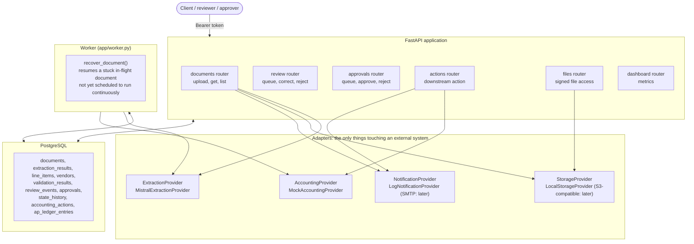

# Architecture

## Components

**Core business logic** (owns no external dependency directly — only interfaces):
- Ingestion & idempotency
- Extraction orchestration
- Deterministic validation engine (arithmetic, required fields)
- Vendor matching
- Duplicate detection
- Review queue & correction capture
- Approval & action dispatch
- State machine & audit log
- Metrics aggregation

**External, behind adapters:**
- Extraction provider(s) — decision deferred, see `docs/extraction-strategy.md`
- Object storage — local disk in dev, S3-compatible (Cloudflare R2 or Backblaze B2) in prod
- Accounting system — a mock internal AP ledger for MVP, a real adapter (Xero/QuickBooks) is Phase 19 stretch scope
- Notification — email

## Process model

One FastAPI application serves the upload endpoint, the review UI, and the metrics dashboard. A single background worker process — not a distributed queue — polls PostgreSQL for documents that need their next processing step and advances them through the state machine (`docs/state-machine.md`). See `docs/adr/0003-worker-model.md` for why a queue is not used. The worker's recovery logic is implemented as of Phase 13 (`app/worker.py`); actually scheduling it to run continuously (a loop, a cron job, a Render background worker) is Phase 17's deployment concern, not built yet.

## The adapter boundary

Every external dependency sits behind a small interface so its concrete implementation can change without touching business logic:

- `ExtractionProvider` — one method: document in, normalized `{fields: {value, confidence, page, bbox, source_text}}` + line items + raw response reference + provider/model version out. Provenance fields are nullable per-field, since not every provider can supply a bounding box — the interface exposes the union of what's meaningful rather than shrinking to the lowest common denominator.
- `StorageProvider` — put/get/sign-url over a document blob.
- `AccountingProvider` — create a payable record; mock implementation for MVP.
- `NotificationProvider` — send a notification to a responsible person.

This boundary is what makes provider swapping (extraction) and cost-frugal testing (fixture replay instead of real calls) both possible from the same design decision — see `docs/testing-strategy.md`.

## Classification: deliberately not a separate stage

No dedicated "is this an invoice?" classifier is built. The upload channel itself establishes intent (a purpose-built invoice-upload endpoint), and extraction's own output serves as the plausibility check: if extraction can't populate a vendor, total, and invoice number at reasonable confidence, the document is routed to review as "not recognized" rather than forced through validation. A dedicated classification stage would only become justified if the input channel changes to something genuinely mixed, such as a shared inbox — see Phase 19.

## Security boundary

Nothing in validation, state-machine, or review logic ever imports a provider SDK directly — only the adapter interfaces. See `docs/security.md` for the full threat/control list.

## Mock ledger vs. real integration

MVP posts approved invoices to an internal PostgreSQL table shaped like a real accounts-payable ledger, behind `AccountingProvider`. A real Xero/QuickBooks sandbox integration is explicitly scoped as Phase 19 stretch work, not abandoned — the interface is designed so that move doesn't require touching validation or review code. Reasoning: a real ERP integration adds OAuth/sandbox overhead disconnected from this project's core learning objective, and risks becoming the bottleneck of earlier phases if pulled forward. The system's honest framing (see `docs/problem.md` and `docs/deployment.md`) never implies the mocked ledger is a real integration.

## Diagram

As built (Phase 18) — every router named below exists in `app/routers/`; the worker exists (`app/worker.py`) but nothing schedules it to run continuously yet (`docs/adr/0003-worker-model.md`, `docs/deployment.md`):

## Essential for MVP vs. deferred

| Component | MVP | Deferred to Phase 19 |
|---|---|---|
| Upload input channel | Yes | Email ingestion adapter |
| One extraction provider | Yes | Second provider / hybrid cross-validation |
| Mock AP ledger | Yes | Real Xero/QuickBooks adapter |
| Amount-threshold approval | Yes | Vendor-tier / cost-center approval rules |
| Deterministic vendor/duplicate matching | Yes | — |
